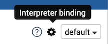
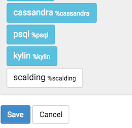
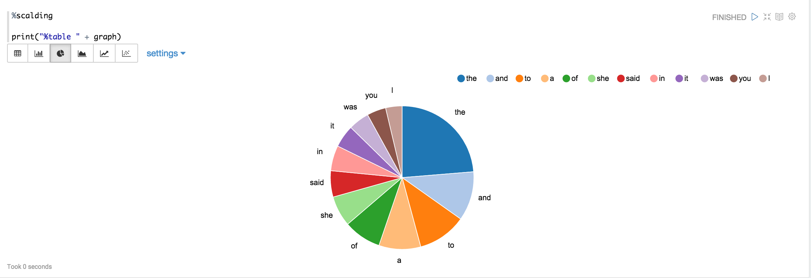



## Scalding Interpreter for Apache Zeppelin
[Scalding](https://github.com/twitter/scalding) is an open source Scala library for writing MapReduce jobs.

### Building the Scalding Interpreter
You have to first build the Scalding interpreter by enable the **scalding** profile as follows:

```
mvn clean package -Pscalding -DskipTests
```

### Enabling the Scalding Interpreter
In a notebook, to enable the **Scalding** interpreter, click on the **Gear** icon,select **Scalding**, and hit **Save**.

<center>





</center>

### Configuring the Interpreter
Zeppelin comes with a pre-configured Scalding interpreter in local mode, so you do not need to install anything.

### Testing the Interpreter
In example, by using the [Alice in Wonderland](https://gist.github.com/johnynek/a47699caa62f4f38a3e2) tutorial, we will count words (of course!), and plot a graph of the top 10 words in the book.

```
%scalding

import scala.io.Source

// Get the Alice in Wonderland book from gutenberg.org:
val alice = Source.fromURL("http://www.gutenberg.org/files/11/11.txt").getLines
val aliceLineNum = alice.zipWithIndex.toList
val alicePipe = TypedPipe.from(aliceLineNum)

// Now get a list of words for the book:
val aliceWords = alicePipe.flatMap { case (text, _) => text.split("\\s+").toList }

// Now lets add a count for each word:
val aliceWithCount = aliceWords.filterNot(_.equals("")).map { word => (word, 1L) }

// let's sum them for each word:
val wordCount = aliceWithCount.group.sum

print ("Here are the top 10 words\n")
val top10 = wordCount
  .groupAll
  .sortBy { case (word, count) => -count }
  .take(10)
top10.dump

```
```
%scalding

val table = "words\t count\n" + top10.toIterator.map{case (k, (word, count)) => s"$word\t$count"}.mkString("\n")
print("%table " + table)

```

If you click on the icon for the pie chart, you should be able to see a chart like this:


### Current Status & Future Work
The current implementation of the Scalding interpreter does not support canceling jobs, or fine-grained progress updates.

The pre-configured Scalding interpreter only supports Scalding in local mode. Hadoop mode for Scalding is currently unsupported, and will be future work (contributions welcome!).
