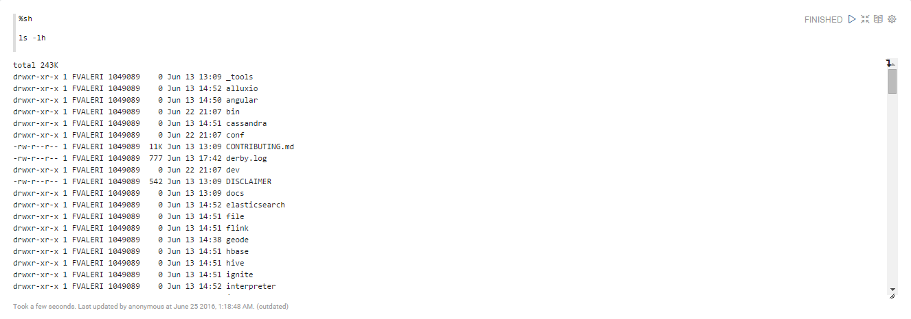

<!--
Licensed under the Apache License, Version 2.0 (the "License");
you may not use this file except in compliance with the License.
You may obtain a copy of the License at

http://www.apache.org/licenses/LICENSE-2.0

Unless required by applicable law or agreed to in writing, software
distributed under the License is distributed on an "AS IS" BASIS,
WITHOUT WARRANTIES OR CONDITIONS OF ANY KIND, either express or implied.
See the License for the specific language governing permissions and
limitations under the License.
-->


# Shell interpreter for Apache Zeppelin

## Overview
Shell interpreter uses [Apache Commons Exec](https://commons.apache.org/proper/commons-exec) to execute external processes. 
In Zeppelin notebook, you can use ` %sh ` in the beginning of a paragraph to invoke system shell and run commands.

> **Note :** Currently each command runs as the user Zeppelin server is running as.

## Configuration
At the "Interpreters" menu in Zeppelin dropdown menu, you can set the property value for Shell interpreter.

<table class="table-configuration">
  <tr>
    <th>Name</th>
    <th>Value</th>
    <th>Description</th>
  </tr>
  <tr>
    <td>shell.command.timeout.millisecs</td>
    <td>60000</td>
    <td>Shell command time out in millisecs</td>
  </tr>
  <tr>
    <td>zeppelin.shell.auth.type</td>
    <td></td>
    <td>Types of authentications' methods supported are SIMPLE, and KERBEROS</td>
  </tr>
  <tr>
    <td>zeppelin.shell.principal</td>
    <td></td>
    <td>The principal name to load from the keytab</td>
  </tr>
  <tr>
    <td>zeppelin.shell.keytab.location</td>
    <td></td>
    <td>The path to the keytab file</td>
  </tr>
</table>

## Example
The following example demonstrates the basic usage of Shell in a Zeppelin notebook.

If you need further information about **Zeppelin Interpreter Setting** for using Shell interpreter, please read [What is interpreter setting?](../manual/interpreters.html#what-is-interpreter-setting) section first.