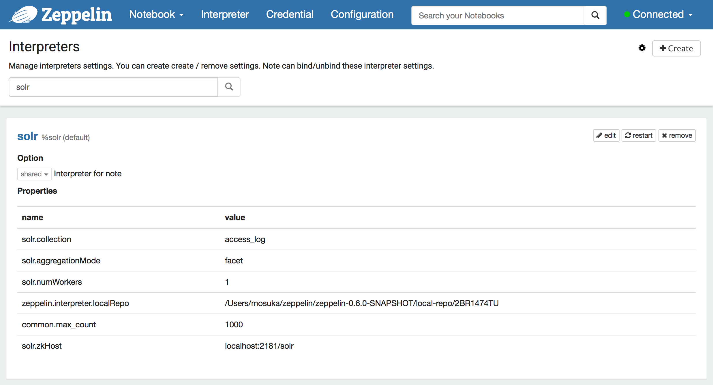
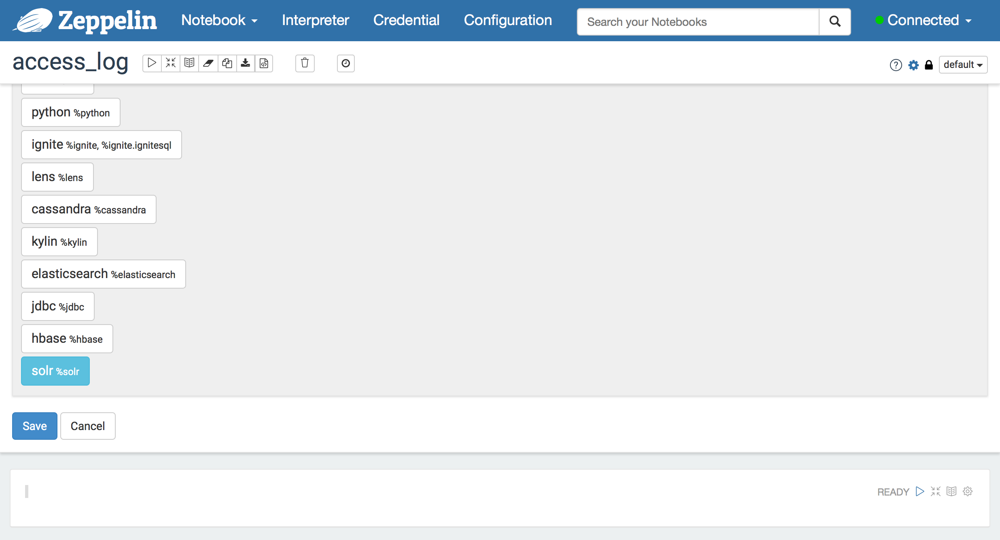
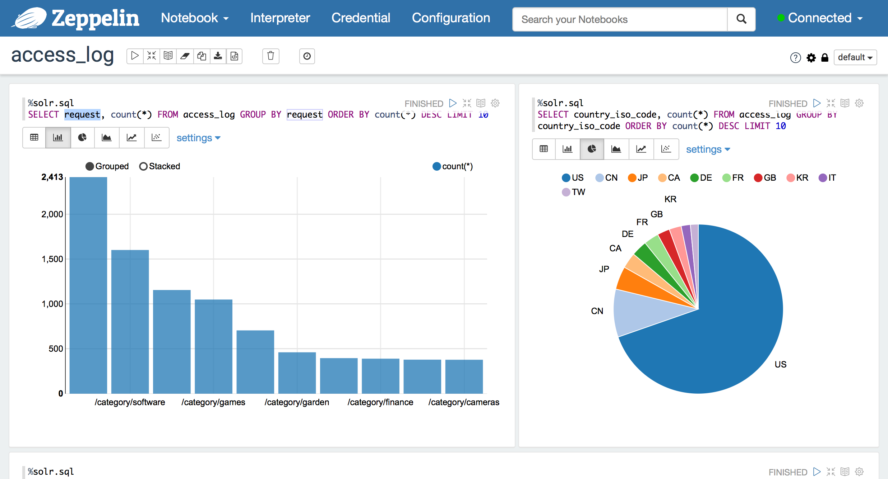



## Solr SQL Interpreter for Apache Zeppelin
[Solr](http://lucene.apache.org/solr/) is the popular, blazing fast, open source NoSQL search platform from the Apache Lucene project. Its major features include powerful full-text search, hit highlighting, faceted search and analytics, rich document parsing, geospatial search, extensive REST APIs as well as parallel SQL. Solr is enterprise grade, secure and highly scalable, providing fault tolerant distributed search and indexing, and powers the search and navigation features of many of the world's largest internet sites.

## Configuration
<table class="table-configuration">
  <tr>
    <th>Property</th>
    <th>Default</th>
    <th>Description</th>
  </tr>
  <tr>
    <td>solr.zkHost</td>
    <td>localhost:2181/solr</td>
    <td>ZooKeeper connection string</td>
  </tr>
  <tr>
    <td>solr.collection</td>
    <td>collection1</td>
    <td>Collection name</td>
  </tr>
  <tr>
    <td>solr.aggregationMode</td>
    <td>facet</td>
    <td>Aggregation mode</td>
  </tr>
  <tr>
    <td>solr.numWorkers</td>
    <td>1</td>
    <td>Number of workers</td>
  </tr>
  <tr>
    <td>common.max_count</td>
    <td>1000</td>
    <td>Max number of SQL result to display</td>
  </tr>
</table>

  

## Enabling the Solr Interpreter
In a notebook, to enable the **Solr** interpreter, click the **Gear** icon and select **Solr**.

  

## Using the Solr Interpreter
In a paragraph, use `%solr` or `%solr.sql` to select the Solr SQL interpreter and then input SQL. To get details, see [Parallel SQL Interface - Apache Solr Reference Guide](https://cwiki.apache.org/confluence/display/solr/Parallel+SQL+Interface).

  

