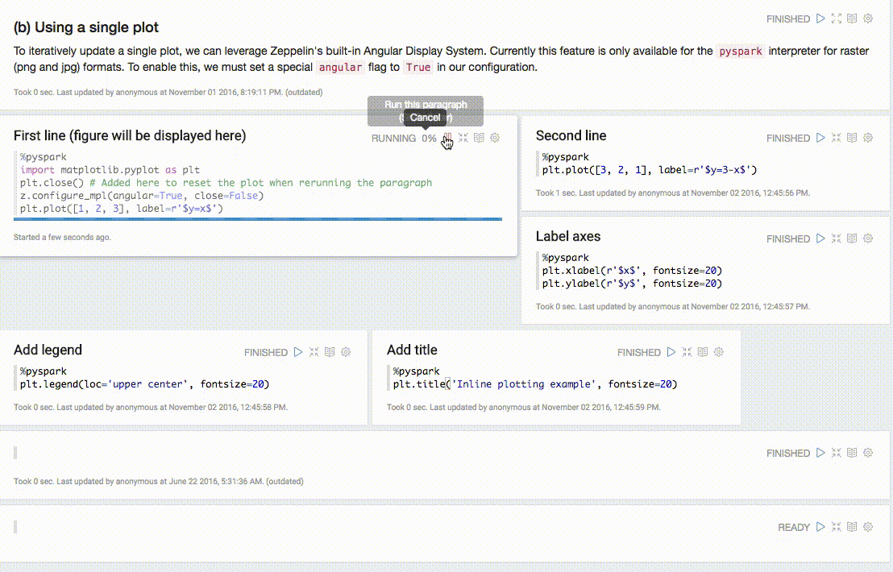
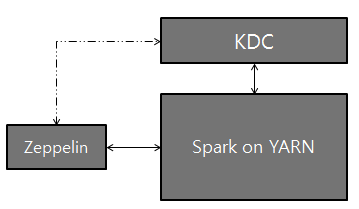

<!--
Licensed under the Apache License, Version 2.0 (the "License");
you may not use this file except in compliance with the License.
You may obtain a copy of the License at

http://www.apache.org/licenses/LICENSE-2.0

Unless required by applicable law or agreed to in writing, software
distributed under the License is distributed on an "AS IS" BASIS,
WITHOUT WARRANTIES OR CONDITIONS OF ANY KIND, either express or implied.
See the License for the specific language governing permissions and
limitations under the License.
-->


# Spark Interpreter for Apache Zeppelin

<div id="toc"></div>

## Overview
[Apache Spark](http://spark.apache.org) is a fast and general-purpose cluster computing system.
It provides high-level APIs in Java, Scala, Python and R, and an optimized engine that supports general execution graphs.
Apache Spark is supported in Zeppelin with Spark interpreter group which consists of below five interpreters.

<table class="table-configuration">
  <tr>
    <th>Name</th>
    <th>Class</th>
    <th>Description</th>
  </tr>
  <tr>
    <td>%spark</td>
    <td>SparkInterpreter</td>
    <td>Creates a SparkContext and provides a Scala environment</td>
  </tr>
  <tr>
    <td>%spark.pyspark</td>
    <td>PySparkInterpreter</td>
    <td>Provides a Python environment</td>
  </tr>
  <tr>
    <td>%spark.r</td>
    <td>SparkRInterpreter</td>
    <td>Provides an R environment with SparkR support</td>
  </tr>
  <tr>
    <td>%spark.sql</td>
    <td>SparkSQLInterpreter</td>
    <td>Provides a SQL environment</td>
  </tr>
  <tr>
    <td>%spark.dep</td>
    <td>DepInterpreter</td>
    <td>Dependency loader</td>
  </tr>
</table>

## Configuration
The Spark interpreter can be configured with properties provided by Zeppelin.
You can also set other Spark properties which are not listed in the table. For a list of additional properties, refer to [Spark Available Properties](http://spark.apache.org/docs/latest/configuration.html#available-properties).
<table class="table-configuration">
  <tr>
    <th>Property</th>
    <th>Default</th>
    <th>Description</th>
  </tr>
  <tr>
    <td>args</td>
    <td></td>
    <td>Spark commandline args</td>
  </tr>
    <td>master</td>
    <td>local[*]</td>
    <td>Spark master uri. <br/> ex) spark://masterhost:7077</td>
  <tr>
    <td>spark.app.name</td>
    <td>Zeppelin</td>
    <td>The name of spark application.</td>
  </tr>
  <tr>
    <td>spark.cores.max</td>
    <td></td>
    <td>Total number of cores to use. <br/> Empty value uses all available core.</td>
  </tr>
  <tr>
    <td>spark.executor.memory </td>
    <td>1g</td>
    <td>Executor memory per worker instance. <br/> ex) 512m, 32g</td>
  </tr>
  <tr>
    <td>zeppelin.dep.additionalRemoteRepository</td>
    <td>spark-packages, <br/> http://dl.bintray.com/spark-packages/maven, <br/> false;</td>
    <td>A list of `id,remote-repository-URL,is-snapshot;` <br/> for each remote repository.</td>
  </tr>
  <tr>
    <td>zeppelin.dep.localrepo</td>
    <td>local-repo</td>
    <td>Local repository for dependency loader</td>
  </tr>
  <tr>
    <td>zeppelin.pyspark.python</td>
    <td>python</td>
    <td>Python command to run pyspark with</td>
  </tr>
  <tr>
    <td>zeppelin.spark.concurrentSQL</td>
    <td>false</td>
    <td>Execute multiple SQL concurrently if set true.</td>
  </tr>
  <tr>
    <td>zeppelin.spark.maxResult</td>
    <td>1000</td>
    <td>Max number of Spark SQL result to display.</td>
  </tr>
  <tr>
    <td>zeppelin.spark.printREPLOutput</td>
    <td>true</td>
    <td>Print REPL output</td>
  </tr>
  <tr>
    <td>zeppelin.spark.useHiveContext</td>
    <td>true</td>
    <td>Use HiveContext instead of SQLContext if it is true.</td>
  </tr>
  <tr>
    <td>zeppelin.spark.importImplicit</td>
    <td>true</td>
    <td>Import implicits, UDF collection, and sql if set true.</td>
  </tr>
</table>

Without any configuration, Spark interpreter works out of box in local mode. But if you want to connect to your Spark cluster, you'll need to follow below two simple steps.

### 1. Export SPARK_HOME
In `conf/zeppelin-env.sh`, export `SPARK_HOME` environment variable with your Spark installation path.

For example,

```bash
export SPARK_HOME=/usr/lib/spark
```

You can optionally set more environment variables

```bash
# set hadoop conf dir
export HADOOP_CONF_DIR=/usr/lib/hadoop

# set options to pass spark-submit command
export SPARK_SUBMIT_OPTIONS="--packages com.databricks:spark-csv_2.10:1.2.0"

# extra classpath. e.g. set classpath for hive-site.xml
export ZEPPELIN_INTP_CLASSPATH_OVERRIDES=/etc/hive/conf
```

For Windows, ensure you have `winutils.exe` in `%HADOOP_HOME%\bin`. Please see [Problems running Hadoop on Windows](https://wiki.apache.org/hadoop/WindowsProblems) for the details.

### 2. Set master in Interpreter menu
After start Zeppelin, go to **Interpreter** menu and edit **master** property in your Spark interpreter setting. The value may vary depending on your Spark cluster deployment type.

For example,

 * **local[*]** in local mode
 * **spark://master:7077** in standalone cluster
 * **yarn-client** in Yarn client mode
 * **mesos://host:5050** in Mesos cluster

That's it. Zeppelin will work with any version of Spark and any deployment type without rebuilding Zeppelin in this way. 
For the further information about Spark & Zeppelin version compatibility, please refer to "Available Interpreters" section in [Zeppelin download page](https://zeppelin.apache.org/download.html).

> Note that without exporting `SPARK_HOME`, it's running in local mode with included version of Spark. The included version may vary depending on the build profile.

## SparkContext, SQLContext, SparkSession, ZeppelinContext
SparkContext, SQLContext and ZeppelinContext are automatically created and exposed as variable names `sc`, `sqlContext` and `z`, respectively, in Scala, Python and R environments.
Staring from 0.6.1 SparkSession is available as variable `spark` when you are using Spark 2.x.

> Note that Scala/Python/R environment shares the same SparkContext, SQLContext and ZeppelinContext instance.

<a name="dependencyloading"> </a>

## Dependency Management
There are two ways to load external libraries in Spark interpreter. First is using interpreter setting menu and second is loading Spark properties.

### 1. Setting Dependencies via Interpreter Setting
Please see [Dependency Management](../manual/dependencymanagement.html) for the details.

### 2. Loading Spark Properties
Once `SPARK_HOME` is set in `conf/zeppelin-env.sh`, Zeppelin uses `spark-submit` as spark interpreter runner. `spark-submit` supports two ways to load configurations. 
The first is command line options such as --master and Zeppelin can pass these options to `spark-submit` by exporting `SPARK_SUBMIT_OPTIONS` in `conf/zeppelin-env.sh`. Second is reading configuration options from `SPARK_HOME/conf/spark-defaults.conf`. Spark properties that user can set to distribute libraries are:

<table class="table-configuration">
  <tr>
    <th>spark-defaults.conf</th>
    <th>SPARK_SUBMIT_OPTIONS</th>
    <th>Description</th>
  </tr>
  <tr>
    <td>spark.jars</td>
    <td>--jars</td>
    <td>Comma-separated list of local jars to include on the driver and executor classpaths.</td>
  </tr>
  <tr>
    <td>spark.jars.packages</td>
    <td>--packages</td>
    <td>Comma-separated list of maven coordinates of jars to include on the driver and executor classpaths. Will search the local maven repo, then maven central and any additional remote repositories given by --repositories. The format for the coordinates should be <code>groupId:artifactId:version</code>.</td>
  </tr>
  <tr>
    <td>spark.files</td>
    <td>--files</td>
    <td>Comma-separated list of files to be placed in the working directory of each executor.</td>
  </tr>
</table>

Here are few examples:

* `SPARK_SUBMIT_OPTIONS` in `conf/zeppelin-env.sh`

  ```bash
    export SPARK_SUBMIT_OPTIONS="--packages com.databricks:spark-csv_2.10:1.2.0 --jars /path/mylib1.jar,/path/mylib2.jar --files /path/mylib1.py,/path/mylib2.zip,/path/mylib3.egg"
  ```
    
* `SPARK_HOME/conf/spark-defaults.conf`

  ```
    spark.jars        /path/mylib1.jar,/path/mylib2.jar
    spark.jars.packages   com.databricks:spark-csv_2.10:1.2.0
    spark.files       /path/mylib1.py,/path/mylib2.egg,/path/mylib3.zip
  ```

### 3. Dynamic Dependency Loading via %spark.dep interpreter
> Note: `%spark.dep` interpreter loads libraries to `%spark` and `%spark.pyspark` but not to  `%spark.sql` interpreter. So we recommend you to use the first option instead.

When your code requires external library, instead of doing download/copy/restart Zeppelin, you can easily do following jobs using `%spark.dep` interpreter.

 * Load libraries recursively from maven repository
 * Load libraries from local filesystem
 * Add additional maven repository
 * Automatically add libraries to SparkCluster (You can turn off)

Dep interpreter leverages Scala environment. So you can write any Scala code here.
Note that `%spark.dep` interpreter should be used before `%spark`, `%spark.pyspark`, `%spark.sql`.

Here's usages.

```scala
%spark.dep
z.reset() // clean up previously added artifact and repository

// add maven repository
z.addRepo("RepoName").url("RepoURL")

// add maven snapshot repository
z.addRepo("RepoName").url("RepoURL").snapshot()

// add credentials for private maven repository
z.addRepo("RepoName").url("RepoURL").username("username").password("password")

// add artifact from filesystem
z.load("/path/to.jar")

// add artifact from maven repository, with no dependency
z.load("groupId:artifactId:version").excludeAll()

// add artifact recursively
z.load("groupId:artifactId:version")

// add artifact recursively except comma separated GroupID:ArtifactId list
z.load("groupId:artifactId:version").exclude("groupId:artifactId,groupId:artifactId, ...")

// exclude with pattern
z.load("groupId:artifactId:version").exclude(*)
z.load("groupId:artifactId:version").exclude("groupId:artifactId:*")
z.load("groupId:artifactId:version").exclude("groupId:*")

// local() skips adding artifact to spark clusters (skipping sc.addJar())
z.load("groupId:artifactId:version").local()
```

## ZeppelinContext
Zeppelin automatically injects `ZeppelinContext` as variable `z` in your Scala/Python environment. `ZeppelinContext` provides some additional functions and utilities.

### Object Exchange
`ZeppelinContext` extends map and it's shared between Scala and Python environment.
So you can put some objects from Scala and read it from Python, vice versa.

<div class="codetabs">
  <div data-lang="scala" markdown="1">


// Put object from scala
%spark
val myObject = ...
z.put("objName", myObject)

// Exchanging data frames
myScalaDataFrame = ...
z.put("myScalaDataFrame", myScalaDataFrame)

val myPythonDataFrame = z.get("myPythonDataFrame").asInstanceOf[DataFrame]


  </div>
  <div data-lang="python" markdown="1">


# Get object from python
%spark.pyspark
myObject = z.get("objName")

# Exchanging data frames
myPythonDataFrame = ...
z.put("myPythonDataFrame", postsDf._jdf)

myScalaDataFrame = DataFrame(z.get("myScalaDataFrame"), sqlContext)


  </div>
</div>

### Form Creation

`ZeppelinContext` provides functions for creating forms.
In Scala and Python environments, you can create forms programmatically.
<div class="codetabs">
  <div data-lang="scala" markdown="1">


%spark
/* Create text input form */
z.input("formName")

/* Create text input form with default value */
z.input("formName", "defaultValue")

/* Create select form */
z.select("formName", Seq(("option1", "option1DisplayName"),
                         ("option2", "option2DisplayName")))

/* Create select form with default value*/
z.select("formName", "option1", Seq(("option1", "option1DisplayName"),
                                    ("option2", "option2DisplayName")))


  </div>
  <div data-lang="python" markdown="1">


%spark.pyspark
# Create text input form
z.input("formName")

# Create text input form with default value
z.input("formName", "defaultValue")

# Create select form
z.select("formName", [("option1", "option1DisplayName"),
                      ("option2", "option2DisplayName")])

# Create select form with default value
z.select("formName", [("option1", "option1DisplayName"),
                      ("option2", "option2DisplayName")], "option1")


  </div>
</div>

In sql environment, you can create form in simple template.

```sql
%spark.sql
select * from ${table=defaultTableName} where text like '%${search}%'
```

To learn more about dynamic form, checkout [Dynamic Form](../manual/dynamicform.html).


## Matplotlib Integration (pyspark)
Both the `python` and `pyspark` interpreters have built-in support for inline visualization using `matplotlib`, a popular plotting library for python. More details can be found in the [python interpreter documentation](../interpreter/python.html), since matplotlib support is identical. More advanced interactive plotting can be done with pyspark through utilizing Zeppelin's built-in [Angular Display System](../displaysystem/back-end-angular.html), as shown below:



## Interpreter setting option

You can choose one of `shared`, `scoped` and `isolated` options wheh you configure Spark interpreter. Spark interpreter creates separated Scala compiler per each notebook but share a single SparkContext in `scoped` mode (experimental). It creates separated SparkContext per each notebook in `isolated` mode.


## Setting up Zeppelin with Kerberos
Logical setup with Zeppelin, Kerberos Key Distribution Center (KDC), and Spark on YARN:



### Configuration Setup

1. On the server that Zeppelin is installed, install Kerberos client modules and configuration, krb5.conf.
This is to make the server communicate with KDC.

2. Set `SPARK_HOME` in `[ZEPPELIN_HOME]/conf/zeppelin-env.sh` to use spark-submit
(Additionally, you might have to set `export HADOOP_CONF_DIR=/etc/hadoop/conf`)

3. Add the two properties below to Spark configuration (`[SPARK_HOME]/conf/spark-defaults.conf`):

        spark.yarn.principal
        spark.yarn.keytab

  > **NOTE:** If you do not have permission to access for the above spark-defaults.conf file, optionally, you can add the above lines to the Spark Interpreter setting through the Interpreter tab in the Zeppelin UI.

4. That's it. Play with Zeppelin!
