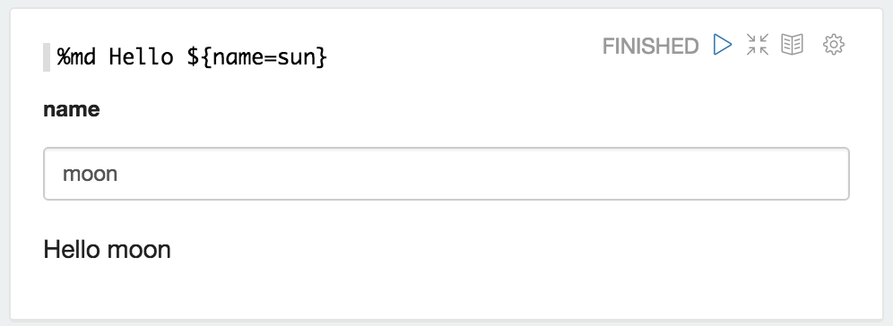
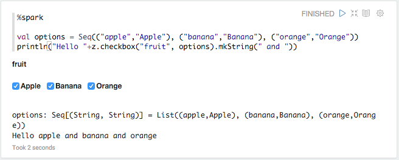

<!--
Licensed under the Apache License, Version 2.0 (the "License");
you may not use this file except in compliance with the License.
You may obtain a copy of the License at

http://www.apache.org/licenses/LICENSE-2.0

Unless required by applicable law or agreed to in writing, software
distributed under the License is distributed on an "AS IS" BASIS,
WITHOUT WARRANTIES OR CONDITIONS OF ANY KIND, either express or implied.
See the License for the specific language governing permissions and
limitations under the License.
-->


## Dynamic Form

Zeppelin dynamically creates input forms. Depending on language backend, there're two different ways to create dynamic form.
Custom language backend can select which type of form creation it wants to use.

### Using form Templates

This mode creates form using simple template language. It's simple and easy to use. For example Markdown, Shell, SparkSql language backend uses it.

#### Text input form

To create text input form, use _${formName}_ templates.

for example

Also you can provide default value, using _${formName=defaultValue}_.

#### Select form

To create select form, use _${formName=defaultValue,option1|option2...}_

for example

Also you can separate option's display name and value, using _${formName=defaultValue,option1(DisplayName)|option2(DisplayName)...}_

#### Checkbox form

For multi-selection, you can create a checkbox form using _${checkbox:formName=defaultValue1|defaultValue2...,option1|option2...}_. The variable will be substituted by a comma-separated string based on the selected items. For example:

Besides, you can specify the delimiter using _${checkbox(delimiter):formName=...}_:

### Creates Programmatically

Some language backend uses programmatic way to create form. For example [ZeppelinContext](../interpreter/spark.html#zeppelincontext) provides form creation API

Here're some examples.

####Text input form

    


%spark
println("Hello "+z.input("name"))


    

    


%pyspark
print("Hello "+z.input("name"))


    

####Text input form with default value

    


%spark
println("Hello "+z.input("name", "sun")) 


    

    


%pyspark
print("Hello "+z.input("name", "sun"))


    

####Select form

    


%spark
println("Hello "+z.select("day", Seq(("1","mon"),
                                    ("2","tue"),
                                    ("3","wed"),
                                    ("4","thurs"),
                                    ("5","fri"),
                                    ("6","sat"),
                                    ("7","sun"))))


    

    


%pyspark
print("Hello "+z.select("day", [("1","mon"),
                                ("2","tue"),
                                ("3","wed"),
                                ("4","thurs"),
                                ("5","fri"),
                                ("6","sat"),
                                ("7","sun")]))


    

#### Checkbox form

    


%spark
val options = Seq(("apple","Apple"), ("banana","Banana"), ("orange","Orange"))
println("Hello "+z.checkbox("fruit", options).mkString(" and "))


    

    


%pyspark
options = [("apple","Apple"), ("banana","Banana"), ("orange","Orange")]
print("Hello "+ " and ".join(z.checkbox("fruit", options, ["apple"])))


    

