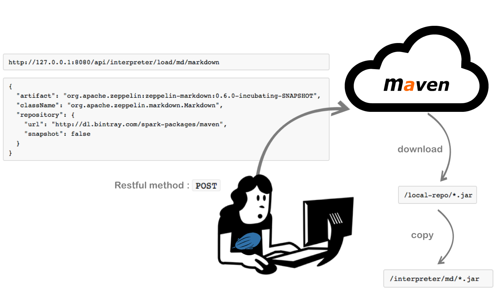
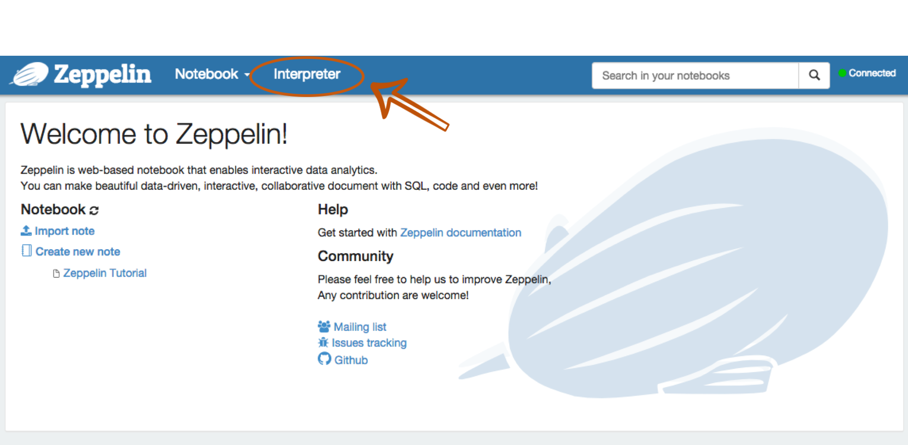
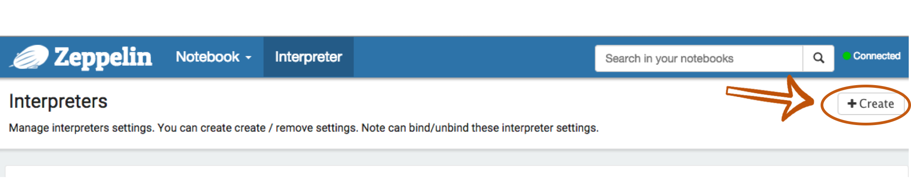
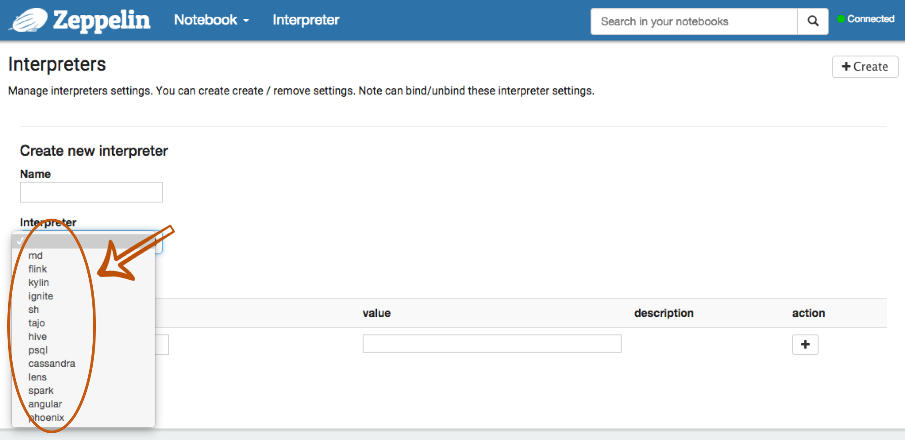
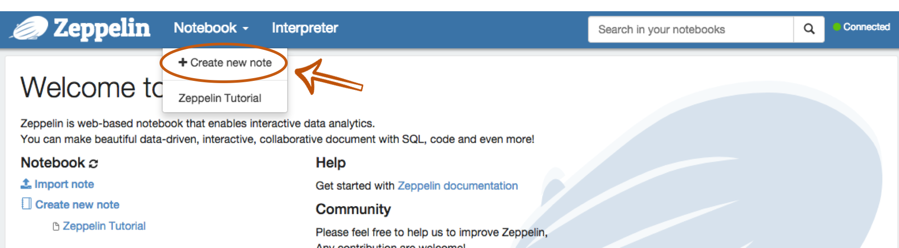
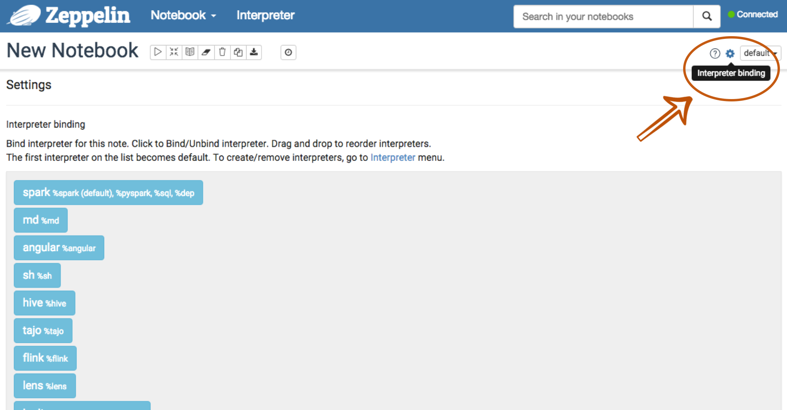

<!--
Licensed under the Apache License, Version 2.0 (the "License");
you may not use this file except in compliance with the License.
You may obtain a copy of the License at

http://www.apache.org/licenses/LICENSE-2.0

Unless required by applicable law or agreed to in writing, software
distributed under the License is distributed on an "AS IS" BASIS,
WITHOUT WARRANTIES OR CONDITIONS OF ANY KIND, either express or implied.
See the License for the specific language governing permissions and
limitations under the License.
-->


## Dynamic Interpreter Loading using REST API

Zeppelin provides pluggable interpreter architecture which results in a wide and variety of the supported backend system. In this section, we will introduce **Dynamic interpreter loading** using **REST API**. This concept actually comes from [Zeppelin Helium Proposal](https://cwiki.apache.org/confluence/display/ZEPPELIN/Helium+proposal).
Before we start, if you are not familiar with the concept of **Zeppelin interpreter**, you can check out [Overview of Zeppelin interpreter](../manual/interpreters.html) first.

<br/>
## Overview 
In the past, Zeppelin was loading interpreter binaries from `/interpreter/[interpreter_name]` directory. They were configured by `zeppelin.interpreters` property in `conf/zeppelin-site.xml` or `ZEPPELIN_INTERPRETERS` env variables in `conf/zeppelin-env.sh`. They were loaded on Zeppelin server startup and stayed alive until the server was stopped.
In order to simplify using 3rd party interpreters, we changed this way to **dynamically** load interpreters from **Maven Repository** using **REST API**. Hopefully, the picture below will help you to understand the process. 
<center></center>

## Load & Unload Interpreters Using REST API

### 1. Load 
You can **load** interpreters located in Maven repository using REST API, like this:

( Maybe, you are unfamiliar with `[interpreter_group_name]` or `[interpreter_name]`. If so, please checkout [Interpreters in Zeppelin](../manual/interpreter.html) again. )

```
http://[zeppelin-server]:[zeppelin-port]/api/interpreter/load/[interpreter_group_name]/[interpreter_name]
```
The Restful method will be <code>**POST**</code>. And the parameters you need are:

  1.  **Artifact:** Maven artifact ( groupId:artifactId:version ) 

  2.  **Class Name:** Package name + Interpreter class name

  3. **Repository ( optional ):** Additional maven repository address

For example, if you want to load `markdown` interpreter to your Zeppelin, the parameters and URL you need may look like:

```
http://127.0.0.1:8080/api/interpreter/load/md/markdown
```

```
{
  "artifact": "org.apache.zeppelin:zeppelin-markdown:0.6.0-incubating-SNAPSHOT",
  "className": "org.apache.zeppelin.markdown.Markdown",
  "repository": {
    "url": "http://dl.bintray.com/spark-packages/maven",
    "snapshot": false
  }
}
```


The meaning of each parameters is: 

  1. **Artifact**
	- groupId: org.apache.zeppelin
	- artifactId: zeppelin-markdown
	- version: 0.6.0-incubating-SNAPSHOT

  2. **Class Name**
	- Package Name: org.apache.zeppelin
	- Interpreter Class Name: markdown.Markdown

  3. **Repository ( optional )**
	- Url: http://dl.bintray.com/spark-packages/maven
	- Snapshot: false

> <b>Please note: </b>The interpreters you downloaded need to be **reload**, when your Zeppelin server is down. 

### 2. Unload
If you want to **unload** the interpreters using REST API, 

```
http://[zeppelin-server]:[zeppelin-port]/api/interpreter/unload/[interpreter_group_name]/[interpreter_name]
```
In this case, the Restful method will be <code>**DELETE**</code>.

<br/>
## What is the next step after Loading ?
 
### Q1. Where is the location of interpreters you downloaded ?
 	
Actually, the answer about this question is in the above picture. Once the REST API is called, the `.jar` files of interpreters you get are saved under `ZEPPELIN_HOME/local-repo` first. Then, they will be copied to `ZEPPELIN_HOME/interpreter` directory. So, please checkout your `ZEPPELIN_HOME/interpreter`.

### Q2. Then, how can I use this interpreter ?

After loading an interpreter, you can use it by creating and configuring it in Zeppelin's **Interpreter tab**.

Oh, you don't need to restart your Zeppelin server. Because it is **Dynamic Loading**, you can configure and load it **at runtime** !

1. After Zeppelin server up, browse Zeppelin home and click **Interpreter tab**.
<center></center>

2. At the **Interpreter** section, click **+Create** button. 
<center></center>
 
3. Then, you can verify the interpreter list that you loaded.
<center></center>

4. After choosing an interpreter, you can configure and use it. Don't forget to save it.

5. Create a new notebook in the **Notebook** section, then you can bind the interpreters from your interpreter list. Just drag and drop !
<center></center>
<center></center>

6. At last, you can use your interpreter !

If you want to get the specific information about respective interpreters, please checkout each interpreter documentation. 
