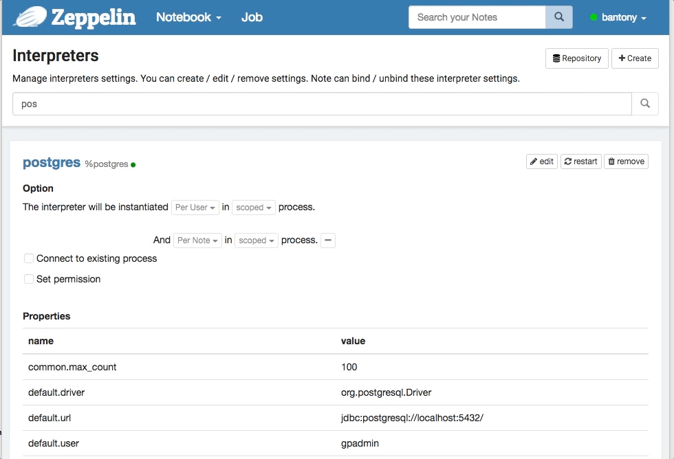
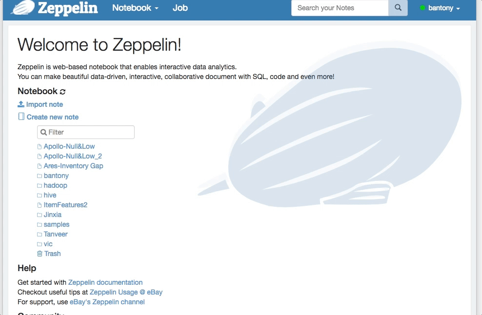

<!--
Licensed under the Apache License, Version 2.0 (the "License");
you may not use this file except in compliance with the License.
You may obtain a copy of the License at

http://www.apache.org/licenses/LICENSE-2.0

Unless required by applicable law or agreed to in writing, software
distributed under the License is distributed on an "AS IS" BASIS,
WITHOUT WARRANTIES OR CONDITIONS OF ANY KIND, either express or implied.
See the License for the specific language governing permissions and
limitations under the License.
-->


## Configure interpreter settings to be overridden by users via properties

 * Add property place holder with a default value in interpreter settings

```
Example :  For JDBC interpreter, common.max_count specifies the maximum number of rows to displayed.

We can configure it to be overridden by users using max_rows property as follows:

     Change interpreter settings common.max_count = ${max_rows,100}

If the user using the interpreter has not specified a value for max_rows, then the default value of 100 will be used.
```

<hr>
<div class="row">
  <div class="col-md-12">
         <b> Screenshot </b>
         <br /><br />
  </div>
  <div class="col-md-12" >
      <a data-lightbox="compiler" href="../assets/themes/zeppelin/img/screenshots/override-interpreter-setting.gif">
        
      </a>

  </div>
</div>
<hr>


 * Specify the property at user level

```
The user can set property by going to the Properties menu and adding a new property.

set max_rows=500

```

<hr>
<div class="row">
  <div class="col-md-12">
         <b> Screenshot </b>
         <br /><br />
  </div>
  <div class="col-md-12" >
      <a data-lightbox="compiler" href="../assets/themes/zeppelin/img/screenshots/set-property.gif">
        
      </a>

  </div>
</div>
<hr>

*  Persisting user properties

```
Setting zeppelin.userproperties.persist to true, stores the user properties under ZEPPELIN-CONF-DIR/properties.json
```
