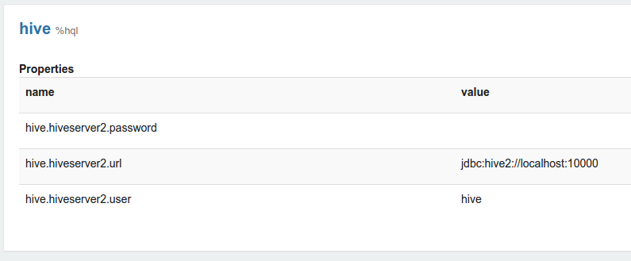
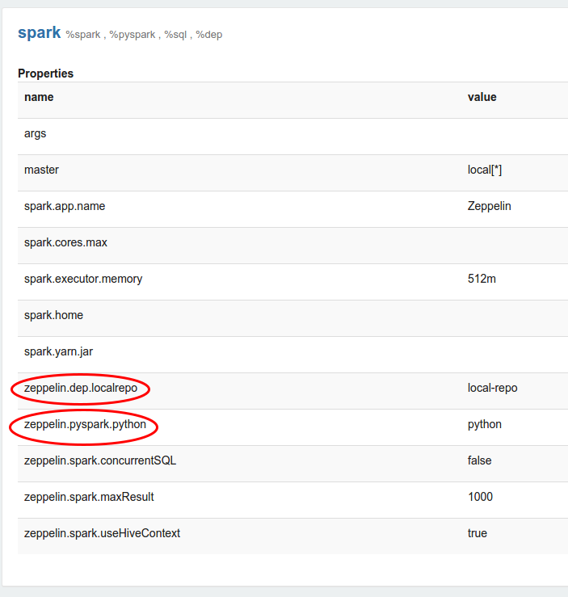

<!--
Licensed under the Apache License, Version 2.0 (the "License");
you may not use this file except in compliance with the License.
You may obtain a copy of the License at

http://www.apache.org/licenses/LICENSE-2.0

Unless required by applicable law or agreed to in writing, software
distributed under the License is distributed on an "AS IS" BASIS,
WITHOUT WARRANTIES OR CONDITIONS OF ANY KIND, either express or implied.
See the License for the specific language governing permissions and
limitations under the License.
-->


# Interpreters in Apache Zeppelin

<div id="toc"></div>

## Overview

In this section, we will explain about the role of interpreters, interpreters group and interpreter settings in Zeppelin.
The concept of Zeppelin interpreter allows any language/data-processing-backend to be plugged into Zeppelin.
Currently, Zeppelin supports many interpreters such as Scala ( with Apache Spark ), Python ( with Apache Spark ), Spark SQL, JDBC, Markdown, Shell and so on.

## What is Zeppelin interpreter?
Zeppelin Interpreter is a plug-in which enables Zeppelin users to use a specific language/data-processing-backend. For example, to use Scala code in Zeppelin, you need `%spark` interpreter.

When you click the ```+Create``` button in the interpreter page, the interpreter drop-down list box will show all the available interpreters on your server.


## What is interpreter setting?
Zeppelin interpreter setting is the configuration of a given interpreter on Zeppelin server. For example, the properties are required for hive JDBC interpreter to connect to the Hive server.



Properties are exported as environment variable when property name is consisted of upper characters, numbers and underscore ([A-Z_0-9]). Otherwise set properties as JVM property.

Each notebook can be bound to multiple Interpreter Settings using setting icon on upper right corner of the notebook.


## What is interpreter group?
Every Interpreter is belonged to an **Interpreter Group**. Interpreter Group is a unit of start/stop interpreter.
By default, every interpreter is belonged to a single group, but the group might contain more interpreters. For example, Spark interpreter group is including Spark support, pySpark, Spark SQL and the dependency loader.

Technically, Zeppelin interpreters from the same group are running in the same JVM. For more information about this, please checkout [here](../development/writingzeppelininterpreter.html).

Each interpreters is belonged to a single group and registered together. All of their properties are listed in the interpreter setting like below image.




## Interpreter binding mode

Each Interpreter Setting can choose one of 'shared', 'scoped', 'isolated' interpreter binding mode.
In 'shared' mode, every notebook bound to the Interpreter Setting will share the single Interpreter instance. In 'scoped' mode, each notebook will create new Interpreter instance in the same interpreter process. In 'isolated' mode, each notebook will create new Interpreter process.


## Connecting to the existing remote interpreter

Zeppelin users can start interpreter thread embedded in their service. This will provide flexibility to user to start interpreter on remote host. To start interpreter along with your service you have to create an instance of ``RemoteInterpreterServer`` and start it as follows:

```
RemoteInterpreterServer interpreter=new RemoteInterpreterServer(3678); 
// Here, 3678 is the port on which interpreter will listen.    
interpreter.start()  

```

The above code will start interpreter thread inside your process. Once the interpreter is started you can configure zeppelin to connect to RemoteInterpreter by checking **Connect to existing process** checkbox and then provide **Host** and **Port** on which interpreter process is listening as shown in the image below:


