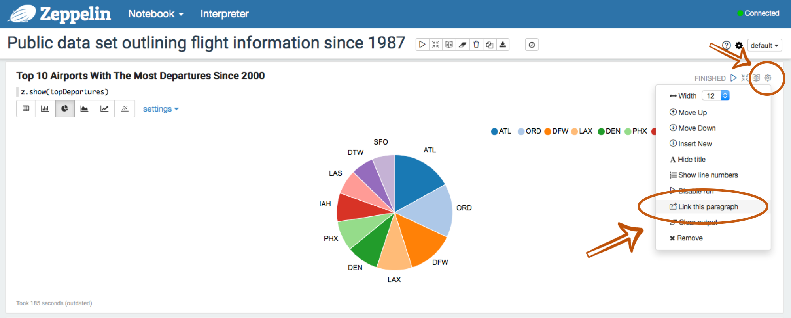
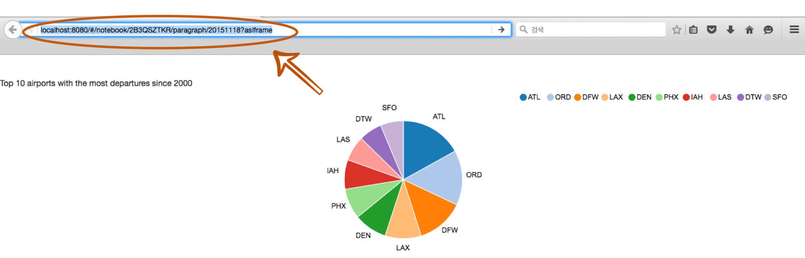
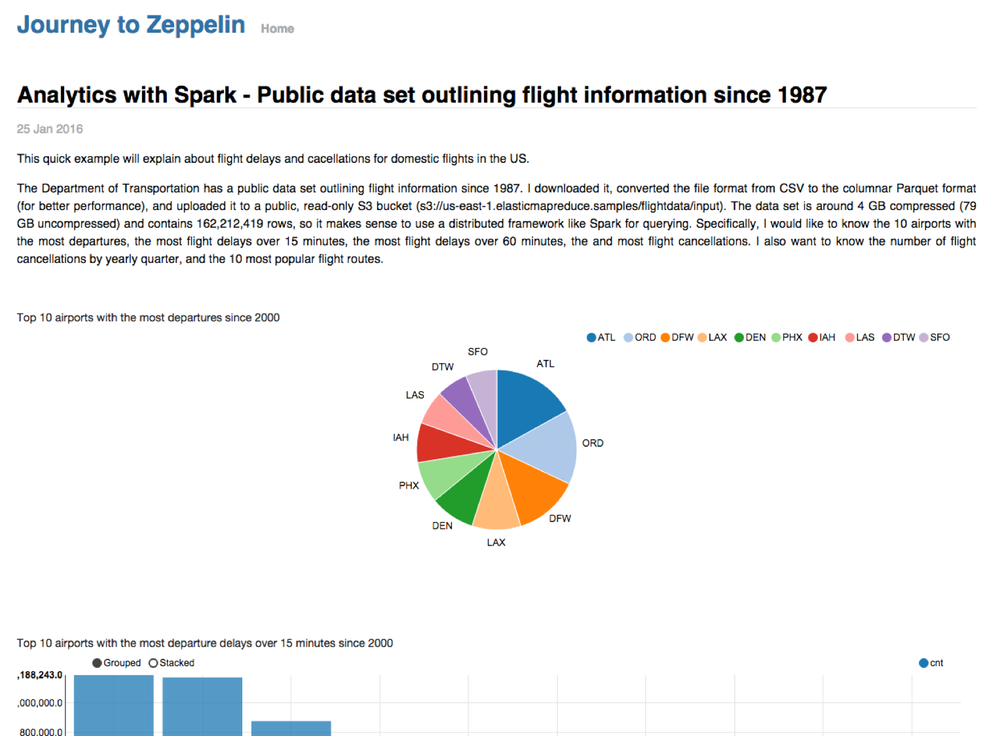

<!--
Licensed under the Apache License, Version 2.0 (the "License");
you may not use this file except in compliance with the License.
You may obtain a copy of the License at

http://www.apache.org/licenses/LICENSE-2.0

Unless required by applicable law or agreed to in writing, software
distributed under the License is distributed on an "AS IS" BASIS,
WITHOUT WARRANTIES OR CONDITIONS OF ANY KIND, either express or implied.
See the License for the specific language governing permissions and
limitations under the License.
-->


# How can you publish your paragraph ?

<div id="toc"></div>

Apache Zeppelin provides a feature for publishing your notebook paragraph results. Using this feature, you can show Zeppelin notebook paragraph results in your own website. 
It's very straightforward. Just use `<iframe>` tag in your page.

## Copy a Paragraph Link
A first step to publish your paragraph result is **Copy a Paragraph Link**.

  * After running a paragraph in your Zeppelin notebook, click a gear button located on the right side. Then, click **Link this Paragraph** menu like below image.
<center></center>
  
  * Just copy the provided link. 
<center></center>

## Embed the Paragraph to Your Website
For publishing the copied paragraph, you may use `<iframe>` tag in your website page.
For example,

```
<iframe src="http://< ip-address >:< port >/#/notebook/2B3QSZTKR/paragraph/...?asIframe" height="" width="" ></iframe>
```

Finally, you can show off your beautiful visualization results in your website. 
<center></center>

> **Note**: To embed the paragraph in a website, Apache Zeppelin needs to be reachable by that website. And please use this feature with caution and in a trusted environment only, as Zeppelin entire Webapp could be accessible by whoever visits your website. 
