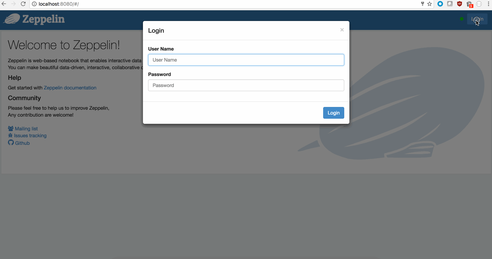

<!--
Licensed under the Apache License, Version 2.0 (the "License");
you may not use this file except in compliance with the License.
You may obtain a copy of the License at

http://www.apache.org/licenses/LICENSE-2.0

Unless required by applicable law or agreed to in writing, software
distributed under the License is distributed on an "AS IS" BASIS,
WITHOUT WARRANTIES OR CONDITIONS OF ANY KIND, either express or implied.
See the License for the specific language governing permissions and
limitations under the License.
-->


## Run zeppelin interpreter process as web front end user

 * Enable shiro auth in shiro.ini

```
[users]
user1 = password1, role1
user2 = password2, role2
```

 * Enable password-less ssh for the user you want to impersonate (say user1).

```
adduser user1
#ssh-keygen (optional if you don't already have generated ssh-key.
ssh user1@localhost mkdir -p .ssh
cat ~/.ssh/id_rsa.pub | ssh user1@localhost 'cat >> .ssh/authorized_keys'
```

* Alternatively instead of password-less, user can override ZEPPELIN_IMPERSONATE_CMD in zeppelin-env.sh

```
export ZEPPELIN_IMPERSONATE_CMD='sudo -H -u ${ZEPPELIN_IMPERSONATE_USER} bash -c '
```
  

 * Start zeppelin server.
 
<hr>
<div class="row">
  <div class="col-md-12">
         <b> Screenshot </b>
         <br /><br />
  </div>
  <div class="col-md-12" >
      <a data-lightbox="compiler" href="../assets/themes/zeppelin/img/screenshots/user-impersonation.gif">
        
      </a>
    
  </div>
</div>
<hr>
 
 * Go to interpreter setting page, and enable "User Impersonate" in any of the interpreter (in my example its shell interpreter)
 
 * Test with a simple paragraph

```
%sh
whoami
```

