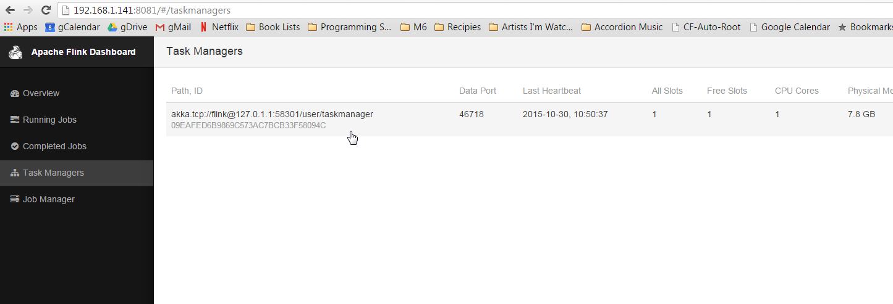
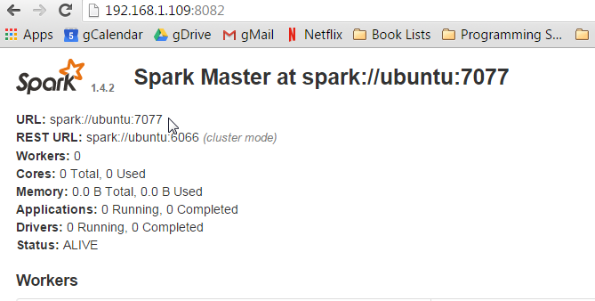

<!--
Licensed under the Apache License, Version 2.0 (the "License");
you may not use this file except in compliance with the License.
You may obtain a copy of the License at

http://www.apache.org/licenses/LICENSE-2.0

Unless required by applicable law or agreed to in writing, software
distributed under the License is distributed on an "AS IS" BASIS,
WITHOUT WARRANTIES OR CONDITIONS OF ANY KIND, either express or implied.
See the License for the specific language governing permissions and
limitations under the License.
-->



# Install with flink and spark cluster

<div id="toc"></div>

This tutorial is extremely entry-level. It assumes no prior knowledge of Linux, git, or other tools. If you carefully type what I tell you when I tell you, you should be able to get Zeppelin running.

## Installing Zeppelin with Flink and Spark in cluster mode

This tutorial assumes the user has a machine (real or [virtual](https://www.virtualbox.org/wiki/Downloads) with a fresh, minimal installation of [Ubuntu 14.04.3 Server](http://www.ubuntu.com/download/server).

**Note:** On the size requirements of the Virtual Machine, some users reported trouble when using the default virtual machine sizes, specifically that the hard drive needed to be at least 16GB- other users did not have this issue.

There are many good tutorials on how to install Ubuntu Server on a virtual box, [here is one of them](http://ilearnstack.com/2013/04/13/setting-ubuntu-vm-in-virtualbox/)

### Required Programs

Assuming the minimal install, there are several programs that we will need to install before Zeppelin, Flink, and Spark.

- git
- openssh-server
- OpenJDK 7
- Maven 3.1+

For git, openssh-server, and OpenJDK 7 we will be using the apt package manager.

##### git
From the command prompt:

```
sudo apt-get install git
```

##### openssh-server

```
sudo apt-get install openssh-server
```

##### OpenJDK 7

```
sudo apt-get install openjdk-7-jdk openjdk-7-jre-lib
```
*A note for those using Ubuntu 16.04*: To install `openjdk-7` on Ubuntu 16.04, one must add a repository.  [Source](http://askubuntu.com/questions/761127/ubuntu-16-04-and-openjdk-7)

``` bash
sudo add-apt-repository ppa:openjdk-r/ppa
sudo apt-get update
sudo apt-get install openjdk-7-jdk openjdk-7-jre-lib
```

##### Maven 3.1+
Zeppelin requires maven version 3.x.  The version available in the repositories at the time of writing is 2.x, so maven must be installed manually.

Purge any existing versions of maven.

```
sudo apt-get purge maven maven2
```

Download the maven 3.3.9 binary.

```
wget "http://www.us.apache.org/dist/maven/maven-3/3.3.9/binaries/apache-maven-3.3.9-bin.tar.gz"
```

Unarchive the binary and move to the `/usr/local` directory.

```
tar -zxvf apache-maven-3.3.9-bin.tar.gz
sudo mv ./apache-maven-3.3.9 /usr/local
```

Create symbolic links in `/usr/bin`.

```
sudo ln -s /usr/local/apache-maven-3.3.9/bin/mvn /usr/bin/mvn
```

### Installing Zeppelin
This provides a quick overview of Zeppelin installation from source, however the reader is encouraged to review the [Zeppelin Installation Guide](../install/install.html)

From the command prompt:
Clone Zeppelin.

```
git clone https://github.com/apache/zeppelin.git
```

Enter the Zeppelin root directory.

```
cd zeppelin
```

Package Zeppelin.

```
mvn clean package -DskipTests -Pspark-1.6 -Dflink.version=1.1.3 -Pscala-2.10
```

`-DskipTests` skips build tests- you're not developing (yet), so you don't need to do tests, the clone version *should* build.

`-Pspark-1.6` tells maven to build a Zeppelin with Spark 1.6.  This is important because Zeppelin has its own Spark interpreter and the versions must be the same.

`-Dflink.version=1.1.3` tells maven specifically to build Zeppelin with Flink version 1.1.3.

-`-Pscala-2.10` tells maven to build with Scala v2.10.


**Note:** You may wish to include additional build flags such as `-Ppyspark` or `-Psparkr`.  See [the build section of github for more details](https://github.com/apache/zeppelin#build).

**Note:** You can build against any version of Spark that has a Zeppelin build profile available. The key is to make sure you check out the matching version of Spark to build. At the time of this writing, Spark 1.6 was the most recent Spark version available.

**Note:** On build failures. Having installed Zeppelin close to 30 times now, I will tell you that sometimes the build fails for seemingly no reason.
As long as you didn't edit any code, it is unlikely the build is failing because of something you did. What does tend to happen, is some dependency that maven is trying to download is unreachable.  If your build fails on this step here are some tips:
- Don't get discouraged.
- Scroll up and read through the logs. There will be clues there.
- Retry (that is, run the `mvn clean package -DskipTests -Pspark-1.6` again)
- If there were clues that a dependency couldn't be downloaded wait a few hours or even days and retry again. Open source software when compiling is trying to download all of the dependencies it needs, if a server is off-line there is nothing you can do but wait for it to come back.
- Make sure you followed all of the steps carefully.
- Ask the community to help you. Go [here](http://zeppelin.apache.org/community.html) and join the user mailing list. People are there to help you. Make sure to copy and paste the build output (everything that happened in the console) and include that in your message.


Start the Zeppelin daemon.

```
bin/zeppelin-daemon.sh start
```

Use `ifconfig` to determine the host machine's IP address. If you are not familiar with how to do this, a fairly comprehensive post can be found [here](http://www.cyberciti.biz/faq/how-to-find-out-the-ip-address-assigned-to-eth0-and-display-ip-only/).

Open a web-browser on a machine connected to the same network as the host (or in the host operating system if using a virtual machine).  Navigate to http://`yourip`:8080, where yourip is the IP address you found in `ifconfig`.

See the [Zeppelin tutorial](../tutorial/tutorial.md) for basic Zeppelin usage. It is also advised that you take a moment to check out the tutorial notebook that is included with each Zeppelin install, and to familiarize yourself with basic notebook functionality.

##### Flink Test
Create a new notebook named "Flink Test" and copy and paste the following code.


```scala

%flink  // let Zeppelin know what interpreter to use.

val text = benv.fromElements("In the time of chimpanzees, I was a monkey",   // some lines of text to analyze
"Butane in my veins and I'm out to cut the junkie",
"With the plastic eyeballs, spray paint the vegetables",
"Dog food stalls with the beefcake pantyhose",
"Kill the headlights and put it in neutral",
"Stock car flamin' with a loser in the cruise control",
"Baby's in Reno with the Vitamin D",
"Got a couple of couches, sleep on the love seat",
"Someone came in sayin' I'm insane to complain",
"About a shotgun wedding and a stain on my shirt",
"Don't believe everything that you breathe",
"You get a parking violation and a maggot on your sleeve",
"So shave your face with some mace in the dark",
"Savin' all your food stamps and burnin' down the trailer park",
"Yo, cut it")

/*  The meat and potatoes:
        this tells Flink to iterate through the elements, in this case strings,
        transform the string to lower case and split the string at white space into individual words
        then finally aggregate the occurrence of each word.

        This creates the count variable which is a list of tuples of the form (word, occurances)

counts.collect().foreach(println(_))  // execute the script and print each element in the counts list

*/
val counts = text.flatMap{ _.toLowerCase.split("\\W+") }.map { (_,1) }.groupBy(0).sum(1)

counts.collect().foreach(println(_))  // execute the script and print each element in the counts list

```

Run the code to make sure the built-in Zeppelin Flink interpreter is working properly.

##### Spark Test
Create a new notebook named "Spark Test" and copy and paste the following code.

```scala
%spark // let Zeppelin know what interpreter to use.

val text = sc.parallelize(List("In the time of chimpanzees, I was a monkey",  // some lines of text to analyze
"Butane in my veins and I'm out to cut the junkie",
"With the plastic eyeballs, spray paint the vegetables",
"Dog food stalls with the beefcake pantyhose",
"Kill the headlights and put it in neutral",
"Stock car flamin' with a loser in the cruise control",
"Baby's in Reno with the Vitamin D",
"Got a couple of couches, sleep on the love seat",
"Someone came in sayin' I'm insane to complain",
"About a shotgun wedding and a stain on my shirt",
"Don't believe everything that you breathe",
"You get a parking violation and a maggot on your sleeve",
"So shave your face with some mace in the dark",
"Savin' all your food stamps and burnin' down the trailer park",
"Yo, cut it"))


/*  The meat and potatoes:
        this tells spark to iterate through the elements, in this case strings,
        transform the string to lower case and split the string at white space into individual words
        then finally aggregate the occurrence of each word.

        This creates the count variable which is a list of tuples of the form (word, occurances)
*/
val counts = text.flatMap { _.toLowerCase.split("\\W+") }
                 .map { (_,1) }
                 .reduceByKey(_ + _)

counts.collect().foreach(println(_))  // execute the script and print each element in the counts list
```

Run the code to make sure the built-in Zeppelin Flink interpreter is working properly.

Finally, stop the Zeppelin daemon.  From the command prompt run:

```
bin/zeppelin-daemon.sh stop
```

### Installing Clusters

##### Flink Cluster

###### Download Binaries

Building from source is recommended  where possible, for simplicity in this tutorial we will download Flink and Spark Binaries.

To download the Flink Binary use `wget`

```bash
wget "http://mirror.cogentco.com/pub/apache/flink/flink-1.1.3/flink-1.1.3-bin-hadoop24-scala_2.10.tgz"
tar -xzvf flink-1.1.3-bin-hadoop24-scala_2.10.tgz
```

This will download Flink 1.1.3, compatible with Hadoop 2.4.  You do not have to install Hadoop for this binary to work, but if you are using Hadoop, please change `24` to your appropriate version.

Start the Flink Cluster.

```bash
flink-1.1.3/bin/start-cluster.sh
```

###### Building From source

If you wish to build Flink from source, the following will be instructive.  Note that if you have downloaded and used the binary version this should be skipped.  The changing nature of build tools and versions across platforms makes this section somewhat precarious.  For example, Java8 and Maven 3.0.3 are recommended for building Flink, which are not recommended for Zeppelin at the time of writing.  If the user wishes to attempt to build from source, this section will provide some reference.  If errors are encountered, please contact the Apache Flink community.

See the [Flink Installation guide](https://github.com/apache/flink/blob/master/README.md) for more detailed instructions.

Return to the directory where you have been downloading, this tutorial assumes that is `$HOME`. Clone Flink,  check out release-1.1.3-rc2, and build.

```
cd $HOME
git clone https://github.com/apache/flink.git
cd flink
git checkout release-1.1.3-rc2
mvn clean install -DskipTests
```

Start the Flink Cluster in stand-alone mode

```
build-target/bin/start-cluster.sh
```

###### Ensure the cluster is up

In a browser, navigate to http://`yourip`:8082 to see the Flink Web-UI.  Click on 'Task Managers' in the left navigation bar. Ensure there is at least one Task Manager present.

<center></center>


If no task managers are present, restart the Flink cluster with the following commands:

(if binaries)
```
flink-1.1.3/bin/stop-cluster.sh
flink-1.1.3/bin/start-cluster.sh
```


(if built from source)
```
build-target/bin/stop-cluster.sh
build-target/bin/start-cluster.sh
```


##### Spark 1.6 Cluster

###### Download Binaries

Building from source is recommended  where possible, for simplicity in this tutorial we will download Flink and Spark Binaries.

Using binaries is also

To download the Spark Binary use `wget`

```bash
wget "http://d3kbcqa49mib13.cloudfront.net/spark-1.6.3-bin-hadoop2.6.tgz"
tar -xzvf spark-1.6.3-bin-hadoop2.6.tgz
mv spark-1.6.3-bin-hadoop2.6 spark
```

This will download Spark 1.6.3, compatible with Hadoop 2.6.  You do not have to install Hadoop for this binary to work, but if you are using Hadoop, please change `2.6` to your appropriate version.

###### Building From source

Spark is an extraordinarily large project, which takes considerable time to download and build. It is also prone to build failures for similar reasons listed in the Flink section.  If the user wishes to attempt to build from source, this section will provide some reference.  If errors are encountered, please contact the Apache Spark community.

See the [Spark Installation](https://github.com/apache/spark/blob/master/README.md) guide for more detailed instructions.

Return to the directory where you have been downloading, this tutorial assumes that is $HOME. Clone Spark, check out branch-1.6, and build.
**Note:** Recall, we're only checking out 1.6 because it is the most recent Spark for which a Zeppelin profile exists at
  the time of writing. You are free to check out other version, just make sure you build Zeppelin against the correct version of Spark. However if you use Spark 2.0, the word count example will need to be changed as Spark 2.0 is not compatible with the following examples.


```
cd $HOME
```

Clone, check out, and build Spark version 1.6.x.

```
git clone https://github.com/apache/spark.git
cd spark
git checkout branch-1.6
mvn clean package -DskipTests
```

###### Start the Spark cluster

Return to the `$HOME` directory.

```bash
cd $HOME
```

Start the Spark cluster in stand alone mode, specifying the webui-port as some port other than 8080 (the webui-port of Zeppelin).

```
spark/sbin/start-master.sh --webui-port 8082
```
**Note:** Why `--webui-port 8082`? There is a digression toward the end of this document that explains this.

Open a browser and navigate to http://`yourip`:8082 to ensure the Spark master is running.

<center></center>

Toward the top of the page there will be a *URL*: spark://`yourhost`:7077.  Note this URL, the Spark Master URI, it will be needed in subsequent steps.

Start the slave using the URI from the Spark master WebUI:

```
spark/sbin/start-slave.sh spark://yourhostname:7077
```

Return to the root directory and start the Zeppelin daemon.

```
cd $HOME

zeppelin/bin/zeppelin-daemon.sh start
```

##### Configure Interpreters

Open a web browser and go to the Zeppelin web-ui at http://yourip:8080.

Now go back to the Zeppelin web-ui at http://`yourip`:8080 and this time click on *anonymous* at the top right, which will open a drop-down menu, select *Interpreters* to enter interpreter configuration.

In the Spark section, click the edit button in the top right corner to make the property values editable (looks like a pencil).
The only field that needs to be edited in the Spark interpreter is the master field. Change this value from `local[*]` to the URL you used to start the slave, mine was `spark://ubuntu:7077`.

Click *Save* to update the parameters, and click *OK* when it asks you about restarting the interpreter.

Now scroll down to the Flink section. Click the edit button and change the value of *host* from `local` to `localhost`. Click *Save* again.

Reopen the examples and execute them again (I.e. you need to click the play button at the top of the screen, or the button on the paragraph .

You should be able check the Flink and Spark webuis (at something like http://`yourip`:8081, http://`yourip`:8082, http://`yourip`:8083) and see that jobs have been run against the clusters.

**Digression** Sorry to be vague and use terms such as 'something like', but exactly what web-ui is at what port is going to depend on what order you started things.
 What is really going on here is you are pointing your browser at specific ports, namely 8081, 8082, and 8083.  Flink and Spark all want to put their web-ui on port 8080, but are
 well behaved and will take the next port available. Since Zeppelin started first, it will get port 8080.  When Flink starts (assuming you started Flink first), it will try to bind to
 port 8080, see that it is already taken, and go to the next one available, hopefully 8081.  Spark has a webui for the master and the slave, so when they start they will try to bind to 8080
   already taken by Zeppelin), then 8081 (already taken by Flink's webui), then 8082. If everything goes smoothy and you followed the directions precisely, the webuis should be 8081 and 8082.
     It *is* possible to specify the port you want the webui to bind to (at the command line by passing the `--webui-port <port>` flag when you start the Flink and Spark, where `<port>` is the port
     you want to see that webui on.  You can also set the default webui port of Spark and Flink (and Zeppelin) in the configuration files, but this is a tutorial for novices and slightly out of scope.


### Next Steps

Check out the [tutorial](./tutorial.md) for more cool things you can do with your new toy!

[Join the community](http://zeppelin.apache.org/community.html), ask questions and contribute! Every little bit helps.
