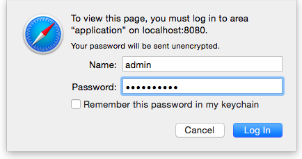

<!--
Licensed under the Apache License, Version 2.0 (the "License");
you may not use this file except in compliance with the License.
You may obtain a copy of the License at

http://www.apache.org/licenses/LICENSE-2.0

Unless required by applicable law or agreed to in writing, software
distributed under the License is distributed on an "AS IS" BASIS,
WITHOUT WARRANTIES OR CONDITIONS OF ANY KIND, either express or implied.
See the License for the specific language governing permissions and
limitations under the License.
-->


# Apache Shiro authentication for Apache Zeppelin

<div id="toc"></div>

## Overview
[Apache Shiro](http://shiro.apache.org/) is a powerful and easy-to-use Java security framework that performs authentication, authorization, cryptography, and session management. In this documentation, we will explain step by step how Shiro works for Zeppelin notebook authentication.

When you connect to Apache Zeppelin, you will be asked to enter your credentials. Once you logged in, then you have access to all notes including other user's notes.

## Security Setup
You can setup **Zeppelin notebook authentication** in some simple steps.

### 1. Enable Shiro
By default in `conf`, you will find `shiro.ini.template`, this file is used as an example and it is strongly recommended
to create a `shiro.ini` file by doing the following command line

```bash
cp conf/shiro.ini.template conf/shiro.ini
```

For the further information about  `shiro.ini` file format, please refer to [Shiro Configuration](http://shiro.apache.org/configuration.html#Configuration-INISections).

### 3. Secure the Websocket channel
Set to property **zeppelin.anonymous.allowed** to **false** in `conf/zeppelin-site.xml`. If you don't have this file yet, just copy `conf/zeppelin-site.xml.template` to `conf/zeppelin-site.xml`.

### 4. Start Zeppelin

```
bin/zeppelin-daemon.sh start (or restart)
```

Then you can browse Zeppelin at [http://localhost:8080](http://localhost:8080).

### 5. Login
Finally, you can login using one of the below **username/password** combinations.

<center></center>

```
[users]

admin = password1, admin
user1 = password2, role1, role2
user2 = password3, role3
user3 = password4, role2
```
You can set the roles for each users next to the password.

## Groups and permissions (optional)
In case you want to leverage user groups and permissions, use one of the following configuration for LDAP or AD under `[main]` segment in `shiro.ini`.

```
activeDirectoryRealm = org.apache.zeppelin.realm.ActiveDirectoryGroupRealm
activeDirectoryRealm.systemUsername = userNameA
activeDirectoryRealm.systemPassword = passwordA
activeDirectoryRealm.searchBase = CN=Users,DC=SOME_GROUP,DC=COMPANY,DC=COM
activeDirectoryRealm.url = ldap://ldap.test.com:389
activeDirectoryRealm.groupRolesMap = "CN=aGroupName,OU=groups,DC=SOME_GROUP,DC=COMPANY,DC=COM":"group1"
activeDirectoryRealm.authorizationCachingEnabled = false

ldapRealm = org.apache.zeppelin.server.LdapGroupRealm
# search base for ldap groups (only relevant for LdapGroupRealm):
ldapRealm.contextFactory.environment[ldap.searchBase] = dc=COMPANY,dc=COM
ldapRealm.contextFactory.url = ldap://ldap.test.com:389
ldapRealm.userDnTemplate = uid={0},ou=Users,dc=COMPANY,dc=COM
ldapRealm.contextFactory.authenticationMechanism = SIMPLE
```

also define roles/groups that you want to have in system, like below;

```
[roles]
admin = *
hr = *
finance = *
group1 = *
```

## Configure Realm (optional)
Realms are responsible for authentication and authorization in Apache Zeppelin. By default, Apache Zeppelin uses [IniRealm](https://shiro.apache.org/static/latest/apidocs/org/apache/shiro/realm/text/IniRealm.html) (users and groups are configurable in `conf/shiro.ini` file under `[user]` and `[group]` section). You can also leverage Shiro Realms like [JndiLdapRealm](https://shiro.apache.org/static/latest/apidocs/org/apache/shiro/realm/ldap/JndiLdapRealm.html), [JdbcRealm](https://shiro.apache.org/static/latest/apidocs/org/apache/shiro/realm/jdbc/JdbcRealm.html) or create [our own](https://shiro.apache.org/static/latest/apidocs/org/apache/shiro/realm/AuthorizingRealm.html).
To learn more about Apache Shiro Realm, please check [this documentation](http://shiro.apache.org/realm.html).

We also provide community custom Realms.

### Active Directory

```
activeDirectoryRealm = org.apache.zeppelin.realm.ActiveDirectoryGroupRealm
activeDirectoryRealm.systemUsername = userNameA
activeDirectoryRealm.systemPassword = passwordA
activeDirectoryRealm.hadoopSecurityCredentialPath = jceks://file/user/zeppelin/conf/zeppelin.jceks
activeDirectoryRealm.searchBase = CN=Users,DC=SOME_GROUP,DC=COMPANY,DC=COM
activeDirectoryRealm.url = ldap://ldap.test.com:389
activeDirectoryRealm.groupRolesMap = "CN=aGroupName,OU=groups,DC=SOME_GROUP,DC=COMPANY,DC=COM":"group1"
activeDirectoryRealm.authorizationCachingEnabled = false
```


Also instead of specifying systemPassword in clear text in shiro.ini administrator can choose to specify the same in "hadoop credential".
Create a keystore file using the hadoop credential commandline, for this the hadoop commons should be in the classpath
`hadoop credential create activeDirectoryRealm.systempassword -provider jceks://file/user/zeppelin/conf/zeppelin.jceks`

Change the following values in the Shiro.ini file, and uncomment the line:
`activeDirectoryRealm.hadoopSecurityCredentialPath = jceks://file/user/zeppelin/conf/zeppelin.jceks`

### LDAP

```
ldapRealm = org.apache.zeppelin.realm.LdapGroupRealm
# search base for ldap groups (only relevant for LdapGroupRealm):
ldapRealm.contextFactory.environment[ldap.searchBase] = dc=COMPANY,dc=COM
ldapRealm.contextFactory.url = ldap://ldap.test.com:389
ldapRealm.userDnTemplate = uid={0},ou=Users,dc=COMPANY,dc=COM
ldapRealm.contextFactory.authenticationMechanism = SIMPLE
```

### PAM
[PAM](https://en.wikipedia.org/wiki/Pluggable_authentication_module) authentication support allows the reuse of existing authentication 
moduls on the host where Zeppelin is running. On a typical system modules are configured per service for example sshd, passwd, etc. under `/etc/pam.d/`. You can
either reuse one of these services or create your own for Zeppelin. Activiting PAM authentication requires two parameters:
 1. realm: The Shiro realm being used
 2. service: The service configured under `/etc/pam.d/` to be used. The name here needs to be the same as the file name under `/etc/pam.d/`
 
```
[main]
 pamRealm=org.apache.zeppelin.realm.PamRealm
 pamRealm.service=sshd
```

### ZeppelinHub
[ZeppelinHub](https://www.zeppelinhub.com) is a service that synchronize your Apache Zeppelin notebooks and enables you to collaborate easily.

To enable login with your ZeppelinHub credential, apply the following change in `conf/shiro.ini` under `[main]` section.

```
### A sample for configuring ZeppelinHub Realm
zeppelinHubRealm = org.apache.zeppelin.realm.ZeppelinHubRealm
## Url of ZeppelinHub
zeppelinHubRealm.zeppelinhubUrl = https://www.zeppelinhub.com
securityManager.realms = $zeppelinHubRealm
```

> Note: ZeppelinHub is not releated to apache Zeppelin project.

## Secure your Zeppelin information (optional)
By default, anyone who defined in `[users]` can share **Interpreter Setting**, **Credential** and **Configuration** information in Apache Zeppelin.
Sometimes you might want to hide these information for your use case.
Since Shiro provides **url-based security**, you can hide the information by commenting or uncommenting these below lines in `conf/shiro.ini`.

```
[urls]

/api/interpreter/** = authc, roles[admin]
/api/configurations/** = authc, roles[admin]
/api/credential/** = authc, roles[admin]
```

In this case, only who have `admin` role can see **Interpreter Setting**, **Credential** and **Configuration** information.
If you want to grant this permission to other users, you can change **roles[ ]** as you defined at `[users]` section.

<br/>
> **NOTE :** All of the above configurations are defined in the `conf/shiro.ini` file. This documentation is originally from [SECURITY-README.md](https://github.com/apache/zeppelin/blob/master/SECURITY-README.md).


## Other authentication methods

- [HTTP Basic Authentication using NGINX](./authentication.html)

