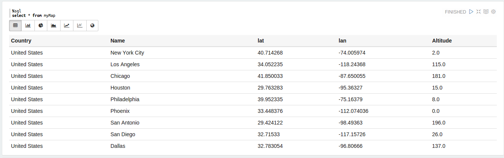
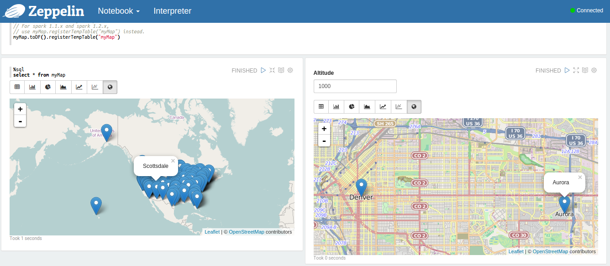

## Tutorial with Map Visualization

Zeppelin is using leaflet which is an open source and mobile friendly interactive map library.

Before starting the tutorial you will need dataset with geographical information. Dataset should contain location coordinates representing, longitude and latitude. Here the online csv file will be used for the next steps.

```scala
import org.apache.commons.io.IOUtils
import java.net.URL
import java.nio.charset.Charset


// load map data
val myMapText = sc.parallelize(
    IOUtils.toString(
        new URL("https://mysite/data.csv"),
        Charset.forName("utf8")).split("\n"))
```

<br />
#### Refine Data

Next to transform data from csv format into RDD of Map objects, run the following script. This will remove the csv headers using filter function. 

```scala
case class Map(Country:String, Name:String, lat : Float, lan : Float, Altitude : Float)

val myMap = myMapText.map(s=>s.split(",")).filter(s=>s(0)!="Country").map(
    s=>Map(s(0), 
            s(1),
            s(2).toFloat,
            s(3).toFloat,
            s(4).toFloat
        )


// Below line works only in spark 1.3.0.
// For spark 1.1.x and spark 1.2.x,
// use myMap.registerTempTable("myMap") instead.
myMap.toDF().registerTempTable("myMap")
```

<br />
#### Data Retrieval and Data Validation

Here is how the dataset is viewed as a table

<div class="row">
  <div class="col-md-12">
    
  </div>
</div>


Dataset can be vaildated by calling `dataValidatorSrv`. It will validate longitude and latitude. If any record is out of range it will point out the recordId and record value with a meaningful error message.

```javascript
var msg = dataValidatorSrv.validateMapData(data);
```
Now data distributions can be viewed on geographical map as below.

```sql
%sql
select * from myMap
where Country = "${Country="United States"}
```

```sql
%sql 
select * from myMap
where Altitude > ${Altitude=300}
```
<div class="row">
  <div class="col-md-12">
    
  </div>
</div>
