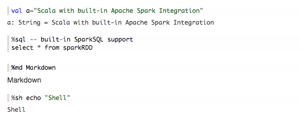



### Zeppelin

Zeppelin is web-based notebook that enables interactive data analytics.
You can make beautiful data-driven, interactive, collaboratable document with SQL, code, markdown, and so on.

Watch [Video](http://youtu.be/_PQbVH_aO5E) and 
[Get Zeppelin](./docs/install/install.html).

 
### Beautiful notebook
Notebook is where you do your analysis, collaborate, publish.

It features inline code editor, configurable layout and many more.

Checkout more [screenshots](./screenshots.html).

 
### Multiple language backend

Zeppelin interpreter concept allow any language/data-processing-backend can be plugged into the Zeppelin.
Currently Scala(with Apache Spark), SparkSQL, Markdown, Shell are included as Zeppelin interpreter.

Adding new language-backend is really simple. checkout [writing zeppelin interpreter](./docs/development/writingzeppelininterpreter.html).

 
### Apache Spark integration

Zeppelin provies built-in Apache Spark integration. You don't need build separate module/plugins/libraries for it.

Zeppelin's Spark integration provies

- Automatic SparkContext and SQLContext injection
- Runtime dependency jar loading from local filesystem or maven repository. Learn more about [dependency loader](./docs/zeppelincontext.html).
- Displaying job progress, Caceling job
- Code auto completion, using Ctrl+. (experimental)

 
### Data visualization

Some basic charts are built-in. Not only SparkSQL's query result but also any output from any language backend can be recognized and visualized.

Learn more about Zeppelin's [Display system](./docs/display.html).

 
### Dynamic form creation

Zeppelin dynamically creates some input forms in notebook.

Learn more about [Dynamic Form](./docs/dynamicform.html).

 
### Collaboration

Notebook URL can be shared among collaborators. Then Zeppelin broadcasts any changes in realtime, like collaboration in Google docs.

 
### Publish

Zeppelin provides a URL that displays single result, that does not include Zeppelin's menu, buttons. So you can eaily embed it using iframe into your website.

 
### 100% Opensource

Zeppelin is Apache2 Licensed software. Checkout [source repository](https://github.com/NFLabs/zeppelin) and [How to contribute](./docs/development/howtocontribute.html)

Zeppelin has very active development community.
Join [Mailing list](https://groups.google.com/forum/#!forum/zeppelin-developers) and checkout 
[Issue tracker](https://zeppelin-project.atlassian.net/browse/ZEPPELIN).

