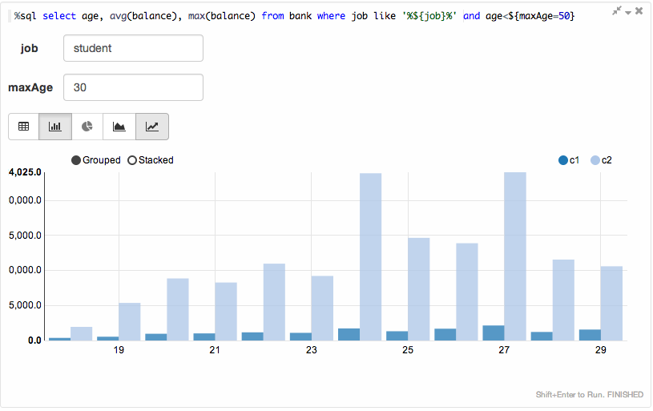
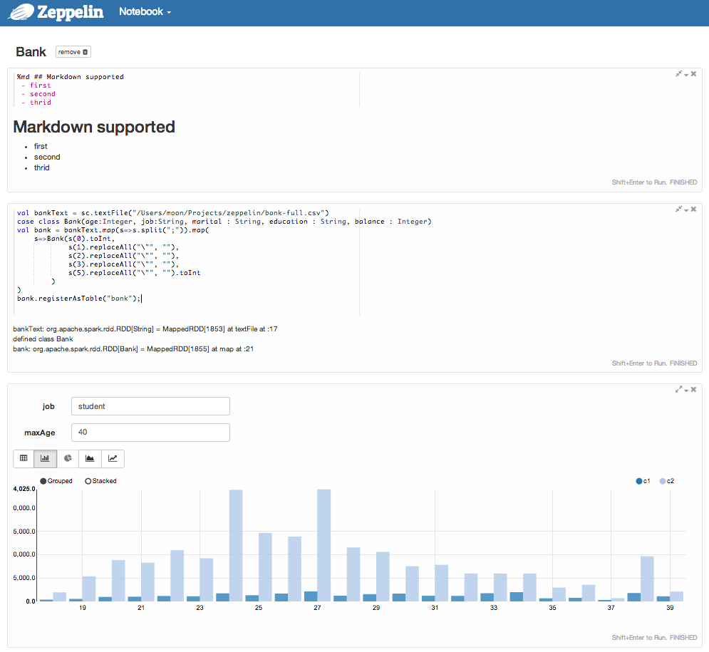



     

          
          
SparkSQL with inline visualization

     

     

          
          
Scala code runs with Spark

     

     

          
          
Markdown supported

     

 

     

          
          
Notebook

     

     

     

     

     

