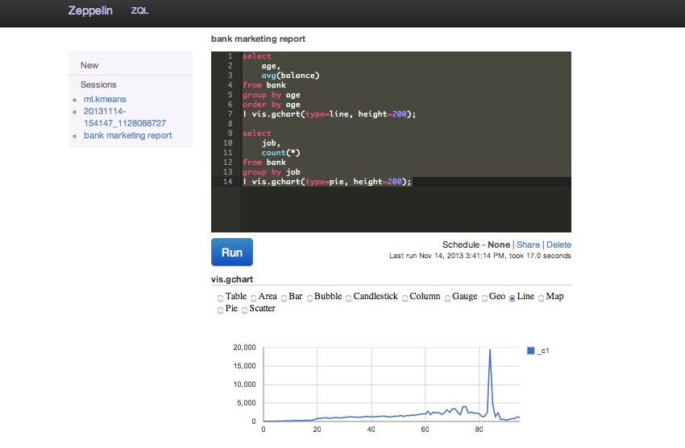
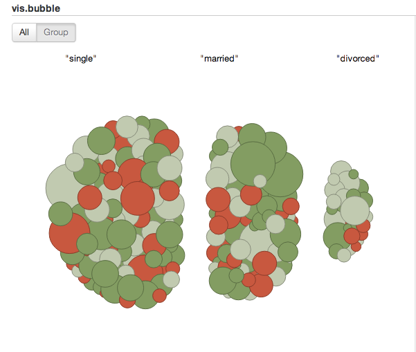
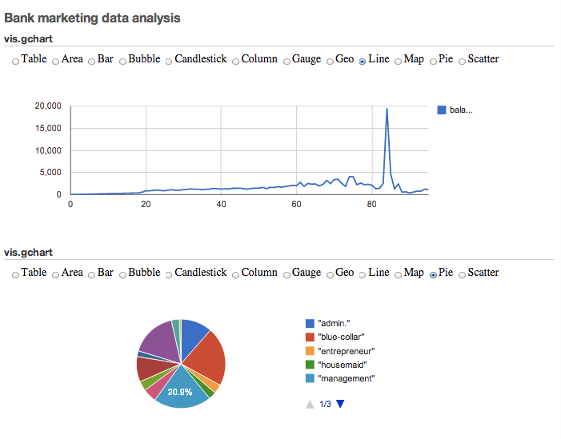
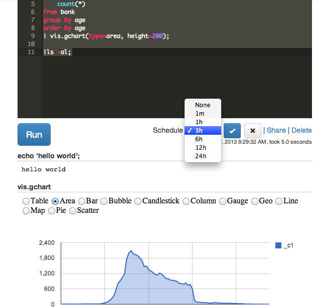
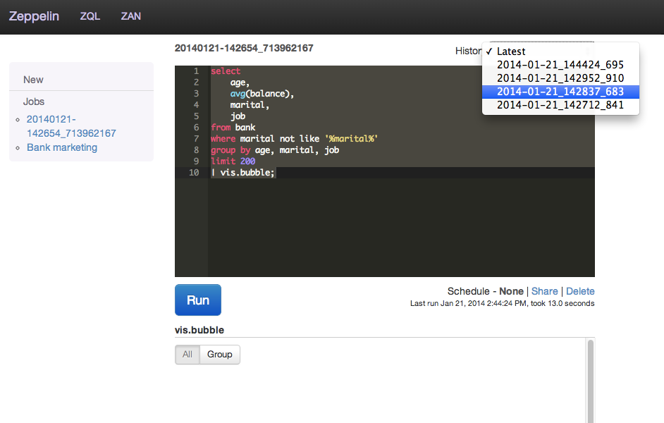
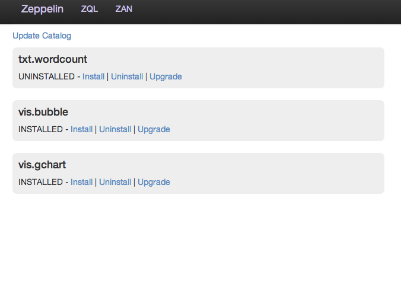



     

          
          
Hive query and visualization

     

     

          
          
Pluggable architecture extends visualization

     

     

          
          
Report sharing

     

 

     

          
          
Job scheduling

     

     

          
          
History management

     

     

          
          
Zeppelin Archive Network

     

