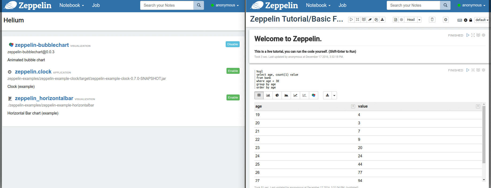
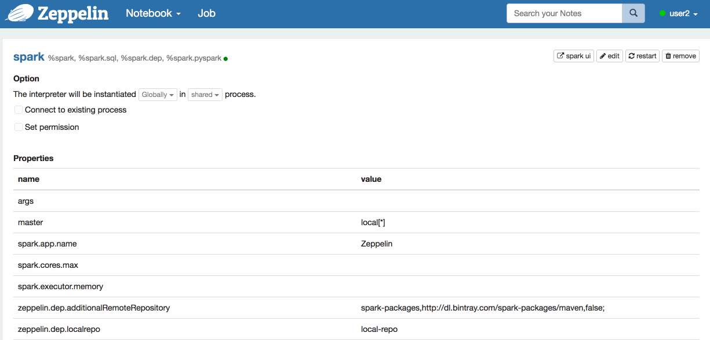
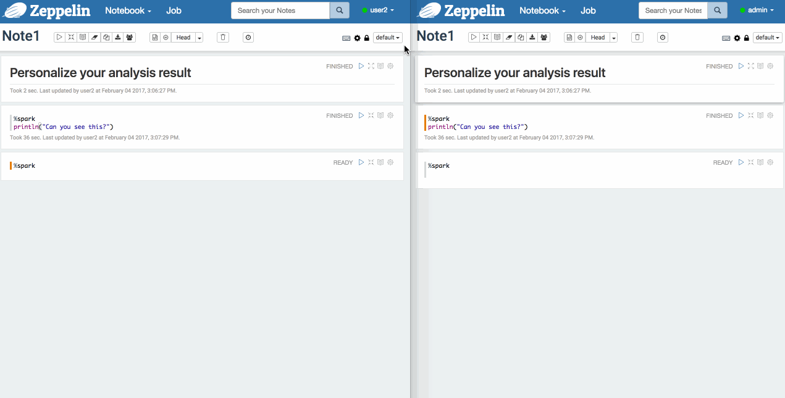

<!--
Licensed under the Apache License, Version 2.0 (the "License");
you may not use this file except in compliance with the License.
You may obtain a copy of the License at

http://www.apache.org/licenses/LICENSE-2.0

Unless required by applicable law or agreed to in writing, software
distributed under the License is distributed on an "AS IS" BASIS,
WITHOUT WARRANTIES OR CONDITIONS OF ANY KIND, either express or implied.
See the License for the specific language governing permissions and
limitations under the License.
-->


  

    <h2>What's new in</h2>
    Apache Zeppelin 0.7
    

      

        <h4>Pluggable Visualization</h4>
        

          Load/unload Javascript 
          <a href="https://www.npmjs.com/" target="_blank">npm packages</a>
          like Zeppelin built-in chart using Helium framework.
          

            <a class="thumbnail text-center" href="#thumb">
              Demo
              
            </a>
          

        

      

      

        <h4>Interpreter Per User / Note</h4>
        

          Separate interpreter running scope 
          Per user or 
          Per Note.
        

        

          <a class="thumbnail text-center" href="#thumb">
            Demo
            
          </a>
        

      

      

        <h4>Personal Note Mode</h4>
        

          Personalize your analysis result by switching the note to Personal Mode.  
        

        

          <a class="thumbnail text-center third" href="#thumb">
            Demo
            
          </a>
        

      

    

    

      

        <h4>Support Spark 2.1</h4>
        

          The latest version of <a href="http://spark.apache.org/releases/spark-release-2-1-0.html" target="_blank">Apache Spark 2.1.0</a> is now available in Zeppelin.
        

      

      

        <h4>New Interpreters</h4>
        

        You can use
        <a href="https://beam.apache.org/" target="_blank">Apache Beam</a>, 
        <a href="https://github.com/spotify/scio" target="_blank">Scio</a>, and
        <a href="https://pig.apache.org/" target="_blank">Apache Pig</a> as backend interpreters from this release.
        

      

    

    

      
See more details in 
        <a href="./releases/zeppelin-release-0.7.0.html">0.7 Release Note</a>
      

    

  

